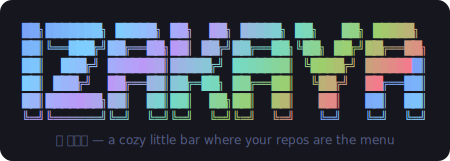
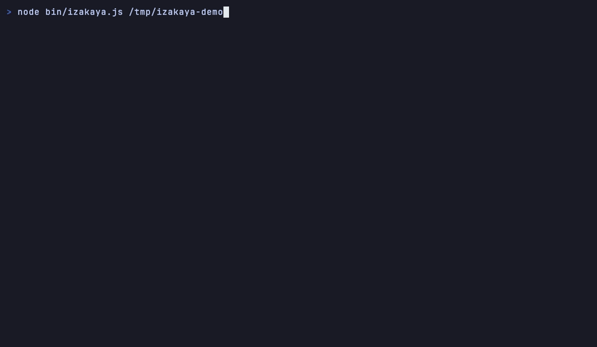

# izakaya





A zero-dependency TokyoNight TUI that scans every project in `~/code` and
serves them up as small plates: git status, last pour (commit), languages,
stack chips, size — and whether the kitchen has posted its house rules
(`CLAUDE.md`).

The header is styled after the Starship TokyoNight prompt, so it looks like
the rest of the terminal it lives in.

## Run

```sh
node bin/izakaya.js          # scans ~/code
node bin/izakaya.js ~/work   # or any other directory
```

Or put it on your PATH:

```sh
npm link   # → izakaya
```

## Keys

| key | what |
| --- | --- |
| `j` / `k` / arrows | browse the menu |
| `g` / `G` | first / last plate |
| `/` | filter the menu (type to narrow, enter keeps, esc clears) |
| `s` | cycle sort: recent → name → size |
| `o` | open the repo in Finder |
| `t` | new terminal window at the repo (Ghostty, falls back to Terminal.app) |
| `e` | open the repo in `$EDITOR` (vim by default) in a new terminal window |
| `c` | start a Claude Code session at the repo in a new terminal window |
| `r` | rescan |
| `q` | leave the bar — a farewell scene with a parting kotowaza, then またね |

The menu also marks plates that need attention: `●` uncommitted changes,
`⇡` commits you haven't pushed.

## The demo GIF

The recording above is staged — `scripts/demo.sh` builds a fake bar of repos
at `/tmp/izakaya-demo` (varied languages, ages, dirty states, unpushed work),
and `docs/demo.tape` replays the session with [vhs](https://github.com/charmbracelet/vhs):

```sh
./scripts/demo.sh && vhs docs/demo.tape
```

## Requirements

- Node ≥ 22
- A nerd font (you're running Starship, you have one)
- A terminal with truecolor (Ghostty, kitty, iTerm2, …)

No dependencies. No build step. One file.

## License

[MIT](LICENSE) — use it, fork it, sell it, just keep the copyright notice.
© Matt Williamson
