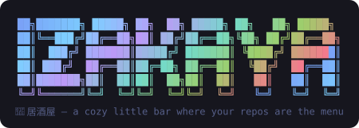
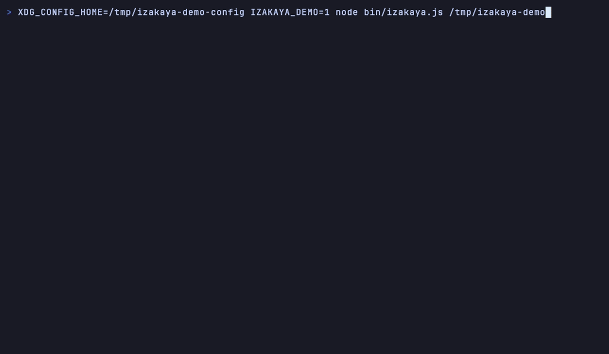
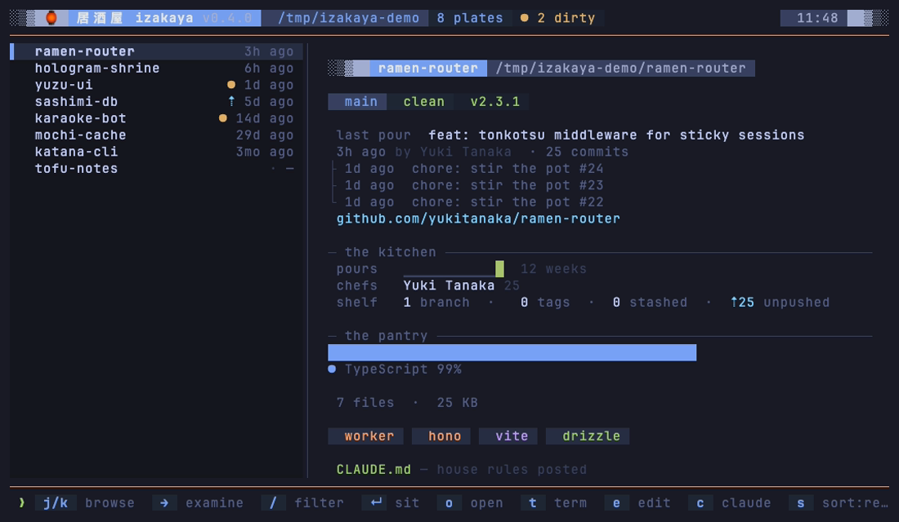
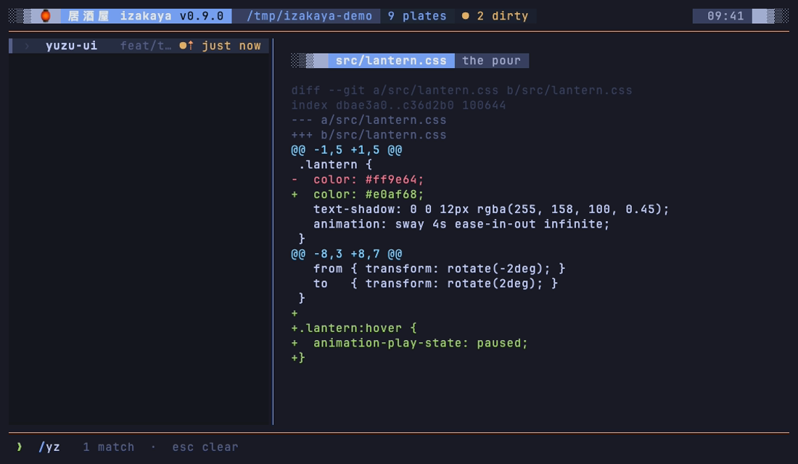
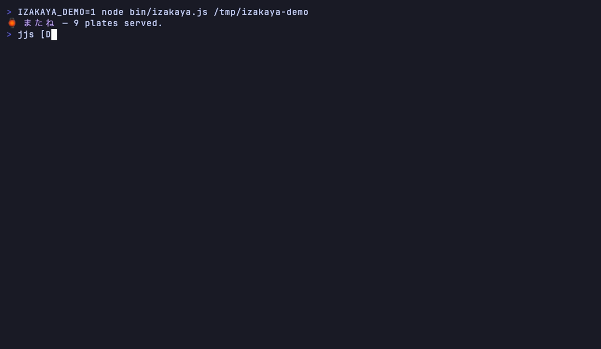

# izakaya





| the menu | peek the pour | closing time |
| --- | --- | --- |
|  |  |  |

A zero-dependency TokyoNight TUI that scans every project in your code
directory and serves them up as small plates: git status, last pour (commit),
languages, stack chips, size — and whether the kitchen has posted its house
rules (`CLAUDE.md`).

It's built to answer the three questions a work morning starts with:

- **What changed while I was gone?** The bar remembers your last visit and
  says so — new pours, plates that joined the menu, work that went unsettled.
- **What needs me?** Dirty plates and unpushed pours are marked on the menu;
  `!` is closing time — one screen of everything that exists only on this
  machine, down to the stash you forgot and the branch that never got pushed.
- **Take me there.** `iz ramen` from the shell seats you in the repo before
  the bar even opens; inside, `↵` on a changed file pours its diff, and one
  key opens the terminal, editor, or Claude Code session where you left it.

The header is styled after the Starship TokyoNight prompt, so it looks like
the rest of the terminal it lives in. One file, no packages, no build step,
and read-only by design — it never writes to the repos it serves.

**Pull up a stool → [izakaya.guru](https://izakaya.guru)**

## Install

The whole app is one zero-dependency file, so installing is really just putting
it on your `PATH`. The installer does that — and offers to add the `iz()` shell
wrapper:

```sh
curl -fsSL https://raw.githubusercontent.com/vajramatt/izakaya/main/scripts/install.sh | sh
```

It drops `izakaya` into `$XDG_BIN_HOME` (or `~/.local/bin`), warns if that's
not on your `PATH`, and checks for **Node ≥ 22** — required, since the file
runs on your system Node rather than shipping as a compiled binary. Prefer to
read before you run? [`scripts/install.sh`](scripts/install.sh) is short and
only ever writes to a bin dir and (with your yes) your shell rc.

Or skip the installer and drop the single file yourself:

```sh
curl -fsSL https://raw.githubusercontent.com/vajramatt/izakaya/main/bin/izakaya.js \
  -o ~/.local/bin/izakaya && chmod +x ~/.local/bin/izakaya
```

Both work on **macOS and Linux**. (Windows is on the [roadmap](ROADMAP.md).)

## Run

```sh
node bin/izakaya.js          # your saved code directory (asks on first visit)
node bin/izakaya.js ~/work   # or any other directory, one-off
```

Or put it on your PATH:

```sh
npm link   # → izakaya
```

Two flags pour and leave without opening the bar:

```sh
izakaya --version   # the vintage, e.g. izakaya 0.3.0 (883c968)
izakaya --help      # the one-screen menu of usage
```

The version rides in the `居酒屋 izakaya` header chip and the colophon (`~`)
too. Run from a checkout and it carries the short commit (`-dirty` when the
tree is); the single curl-installed file, with no `.git` beside it, shows the
bare version.

On the first visit the bar asks where your work lives and remembers the
answer. Press `w` any time to move the bar to a different directory. The
root resolves in this order:

1. CLI argument
2. `$IZAKAYA_ROOT`
3. the saved answer in `~/.config/izakaya/config.json`
4. the first-visit prompt (default `~/code`)

Repeat visits open instantly on the last menu (cached per root in
`~/.cache/izakaya/menu.json`) while every plate is re-checked in place.
Scanning pours twice: a quick pass gets the whole menu up fast, then the
deep history — the activity sparkline, the chefs, the AI tally — simmers
in behind it.

### Nested projects

Repos often live together inside a parent folder, so the menu can be opened
like a tree. Highlight a parent and press `→`: its immediate subfolders appear
as indented rows directly underneath, and the first child is selected. The
dashboard on the right immediately switches to that subfolder.

```text
⌄ lantern-labs
  └ › lantern-api      ← selected; its dashboard is on the right
  └ › lantern-web
```

Use `↑` / `↓` to move between the children. Every launcher acts on the
highlighted folder, so `t`, `e`, `c`, `o`, `y`, and `↵` all use its exact path.
Press `→` on a child to go another level deeper, or `←` to return to its parent.
Generated and internal folders such as `.git`, `node_modules`, `dist`, and
`build` stay hidden.

## Keys

| key | what |
| --- | --- |
| `j` / `k` / arrows | browse the menu |
| `→` / `←` | expand subfolders / back out; press `→` again to walk into the open tab |
| `↑` / `↓` | behind the bar: move file-by-file down the open tab |
| `↵` (behind the bar) | peek the pour — the file's diff, read-only; esc sets it down |
| `g` / `G` | first / last plate |
| `J` / `K` | scroll the selected plate's details |
| `/` | fuzzy filter the menu — `izk` finds izakaya (enter keeps, esc clears) |
| `d` | dirty plates only — just the repos with unfinished work |
| `!` | closing time — every plate carrying work only this machine holds: dirty files, stashes, commits on any branch no remote has, repos that never left the house |
| `s` | cycle sort: recent → name → size |
| `T` | change the lanterns — cycle the theme: tokyonight → iceberg → nord → catppuccin-mocha (remembered) |
| `↵` | sit down — leave, and the `iz()` wrapper cd's you into the repo |
| `o` | open the repo in the file manager — behind the bar, reveal the file |
| `t` | new terminal window at the selected repo or subfolder |
| `u` | the usual — your own session script, launched at the repo ([see below](#the-usual--bring-your-own-session)) |
| `e` | open the repo in `$EDITOR` (vim by default) in a new terminal window — behind the bar, open the file |
| `c` | start a Claude Code session at the repo in a new terminal window |
| `C` | resume the Claude session there (`claude --continue`) — the plate says when Claude last spoke |
| `b` | open the repo's remote in the browser |
| `y` | copy the repo's path — behind the bar, the file's |
| `w` | move the bar — scan a different directory |
| `r` | rescan |
| `?` | the back page of the menu — all keys |
| `~` | colophon — who keeps this bar |
| `q` / esc | leave the bar — esc first clears any filter, then またね |

The menu marks plates that need attention: `●` uncommitted changes, `⇡`
commits you haven't pushed, and a small moon on plates untouched for half
a year.

The bar also remembers your last visit. When the first scan finishes it
tells you what changed while you were gone — new pours, plates that joined
or left the menu, work that went unsettled — and marks freshly-poured
plates with a teal `+` until you rescan.

And if GitHub's [`gh`](https://cli.github.com) CLI is installed, examining
a plate (`→`) quietly asks the street about it: open PRs and the latest
checks appear under the remote. Lazy — only the plate you examine — and
silent when `gh` is missing, signed out, or the remote isn't GitHub.

### The launch keys, across platforms

Browsing the menu works anywhere Node does. The launch keys (`o` `t` `e` `c`
`b` `y`) reach out to the OS, so how far they go depends on where you sit:

- **`o` open · `b` browser · `y` copy** — full parity on **macOS and Linux**.
  macOS uses `open` and `pbcopy`; Linux uses `xdg-open`, and for the clipboard
  `wl-copy` (Wayland), `xclip`, or `xsel` — whichever you have installed. With
  none of them around, `y` asks the terminal itself via **OSC 52** — zero
  processes, and it works over a bare SSH session too.
- **`t` terminal · `e` editor · `c` claude** — spawn a new terminal window.
  - **inside tmux** (any platform), a new window means a **tmux window** at
    the repo — the bar meets you where you live, not over it.
  - **macOS** drives Ghostty over AppleScript, falling back to Terminal.app.
  - **Linux** has no standard terminal, so izakaya looks for one in order:
    **kitty → wezterm → alacritty → foot**. To use anything else (or to force
    a choice), set it yourself:

    ```sh
    export IZAKAYA_TERMINAL="kitty"      # env var, or…
    ```
    ```json
    // ~/.config/izakaya/config.json
    { "terminal": "kitty" }
    ```

    A known emulator's name gets the right flags automatically; anything else
    is launched at the repo's directory on a best-effort basis. If no terminal
    is found and none is configured, `t`/`e`/`c` say so and open the folder
    instead.

If a tool a key needs isn't installed, the key tells you what's missing rather
than failing in silence.

## What's on a plate

Select a repo and the right panel fills in:

- a powerline status ribbon — branch, clean/dirty, ahead/behind, version —
  shaped like the Starship prompt it sits under
- **the open tab** — the uncommitted changes, file by file and colored by
  status (modified, added, deleted, renamed, untracked), staged marked. Press
  `→` to step behind the bar and walk the tab with `↑`/`↓`; the file you're on
  glows orange, and `↵` peeks the pour — its diff, right there, read-only
- **the last pour** and the few before it: recent commits with ages
- **the kitchen** — a 12-week sparkline of commit activity, the chefs who
  cook here, and the shelf: branches, tags, stashes
- **the pantry** — a language bar with percentages, file count, and size on
  disk
- **the hand behind the bar** — how much of the recent work Claude
  co-authored and with which models, plus whether a Claude Code session is
  open at this repo and when it last spoke (`C` picks it back up)
- **word from the street** — with `gh` installed, the plate you examine
  shows its open PRs and latest checks
- stack chips (frameworks and tooling it spotted), the remote, whether
  `CLAUDE.md` is posted, and the README's opening line in quotes

Repos without git are still served, marked as off-menu items.

## The launcher — `iz()`

izakaya can hand your shell the repo you picked. Press `↵` on a plate and
the bar writes its path to the seat file (`~/.cache/izakaya/seat`, or under
`$XDG_CACHE_HOME` if you set one) on the way out; a tiny wrapper turns that
into a `cd`:

```zsh
# ~/.zshrc
iz() {
  izakaya "$@"
  local seat="${XDG_CACHE_HOME:-$HOME/.cache}/izakaya/seat"
  if [[ -f "$seat" ]]; then
    cd -- "$(<"$seat")" && command rm -f -- "$seat"
  fi
}
```

Browse, press `↵`, and you're standing in the repo.

Faster still: give `iz` the name. `iz ramen` fuzzy-matches against last
visit's menu, and when exactly one plate answers you're seated without the
bar even opening — two keystrokes and a word to be anywhere. If several
match, the bar opens pre-filtered so you can pick.

For **fish**, the same idea in fish syntax (`~/.config/fish/config.fish`):

```fish
function iz
    izakaya $argv
    set -l seat (set -q XDG_CACHE_HOME; and echo $XDG_CACHE_HOME; or echo $HOME/.cache)/izakaya/seat
    if test -f "$seat"
        cd (cat "$seat"); and command rm -f -- "$seat"
    end
end
```

## The usual — bring your own session

If your day starts with your own session script — tmux panes, agents, vim,
gitui, logs, all arranged just so — tell the bar your order once:

```sh
export IZAKAYA_USUAL="dev-session"        # env var, or…
```
```json
// ~/.config/izakaya/config.json
{ "usual": "~/bin/dev-session" }
```

Then `u` on any plate fires it at that repo: launched through the same
platform layer as `t`/`e`/`c` (a **tmux window** when you're inside tmux, a
terminal window otherwise), via `$SHELL -lc` so your login environment is
there, with the working directory at the repo and the repo's absolute path
as `$1`. Extra flags ride along fine: `"usual": "dev-session --layout full"`.

The command comes **only** from your env or config — izakaya never runs
anything it finds inside a scanned repo, so browsing a freshly-cloned
stranger's project stays exactly as safe as reading it. And if you'd rather
enter through the shell, the `iz()` wrapper composes too: add your script
after the `cd` and every `↵` becomes a session.

## Themes — the lanterns

TokyoNight (Night) is the house light, but the bar hangs four:
**tokyonight · iceberg · nord · catppuccin-mocha**. Press `T` to change the
lanterns live — the whole room repaints in one frame — and the choice is
remembered. Or set it ahead of time:

```sh
export IZAKAYA_THEME="nord"          # env var, or…
```
```json
// ~/.config/izakaya/config.json
{ "theme": "catppuccin-mocha" }
```

Every color the bar paints flows through the active theme — panes, plates,
diffs, the header ramp, even the splash gradient — and a theme is pure data
(the same two dozen keys plus gradient stops), so adding one is a ~30-line,
data-only pull request. Hexes come from each palette's canonical definitions.

## Atmosphere

Leave the bar alone for half a minute and it quietly lives — the master
wipes a glass, steam curls off the kettle, the lantern sways a little. Any
key snaps it back to business. And on the way out, `q` pours a parting
kotowaza — dealt from a persistent shuffled deck, so you hear every saying
once before any repeats.

## The takeout window — for scripts, cron, and agents

The bar is for people; the scanner is happy to serve anything that can read
JSON. Two flags skip the TUI entirely — no TTY, no alt screen, and nothing
written, not even the menu cache:

```sh
izakaya --report [root]          # the whole menu as one JSON document
izakaya --closing-time [root]    # what dies with this laptop — plain text
izakaya --closing-time --json    # the same sweep, structured
```

`--report` prints every plate the bar would serve — git status, the open
tab, ahead/behind, unpushed pours, stashes, languages, stack chips, the
Claude session age and AI-assisted share. The `schema` field mirrors the
menu-cache version and bumps whenever a plate changes shape, so anything
built on it can notice instead of break. An agent gets the answer to
"which repos need attention, and where did Claude leave off?" in one call.

`--closing-time` is the `!` scene to go: every plate carrying work only
this machine holds. The exit code does the talking — `1` when something's
at risk, `0` when the stove is clean, `2` when the root can't be read — so
a cron line or an agent heartbeat can nag without parsing a thing:

```sh
izakaya --closing-time || say "the stove is still on"
```

Text output is colored on a TTY and plain in a pipe. Root resolution
matches the bar: argument > `$IZAKAYA_ROOT` > saved config > `~/code`.

## Read-only, by design

izakaya never writes to the repos it scans. The only files it touches are
its own:

- `~/.config/izakaya/config.json` — where your work lives, your `theme`,
  your optional `usual` session script, and (on Linux) an optional
  `terminal` override (`$XDG_CONFIG_HOME` respected)
- `~/.cache/izakaya/menu.json` — the warm-start menu, keyed by root
- `~/.cache/izakaya/sayings.json` — the kotowaza deck's cursor
- `~/.cache/izakaya/seat` — the `↵` cd target the `iz()` wrapper consumes

(the cache trio lives under `$XDG_CACHE_HOME/izakaya` when that's set)

Everything else — Finder, terminal windows, the editor, Claude Code, the
browser, the clipboard — is a launch, not a mutation.

## The demo GIF

The recording above is staged — `scripts/demo.sh` builds a fake bar of repos
at `/tmp/izakaya-demo` (varied languages, ages, dirty states, unpushed work),
and `docs/demo.tape` replays the session with [vhs](https://github.com/charmbracelet/vhs).
The stills in the table up top are `Screenshot` frames from the same tape:

```sh
./scripts/demo.sh && vhs docs/demo.tape
```

Hacking on the bar? `node --test` runs the tasting flight in `test/` — pure
helpers only, still zero dependencies (`node:test` ships with node) — and CI
runs it on macOS and Linux plus a pty smoke render of the real thing.

## Requirements

- Node ≥ 22
- A nerd font (you're running Starship, you have one)
- A terminal with truecolor (Ghostty, kitty, iTerm2, …)
- **Browsing** works on any platform Node runs on. The **launch keys** go
  furthest on macOS and Linux: `o`/`b`/`y` work on both; terminal spawning
  (`t`/`e`/`c`) works with Ghostty/Terminal.app on macOS, and with kitty,
  wezterm, alacritty, or foot on Linux — or any terminal you point
  `IZAKAYA_TERMINAL` / the `terminal` config field at. See
  [the launch keys, across platforms](#the-launch-keys-across-platforms).

No dependencies. No build step. One file.

## License

[MIT](LICENSE) — use it, fork it, sell it, just keep the copyright notice.
© Matt Williamson
